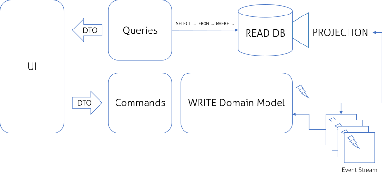

CQRS and DDD with Symfony - First steps
============================

### Schema

###Getting started

In order to set application up you must follow by steps:

1. Install VirtualBox, Vagrant,
2. Install the following vagrant plugins
    - Vagrant WinNFSd: `vagrant plugin install vagrant-winnfsd`
3. Go to vagrant directory: `cd vagrant`
4. Run Vagrant Virtual Machine `vagrant up`
